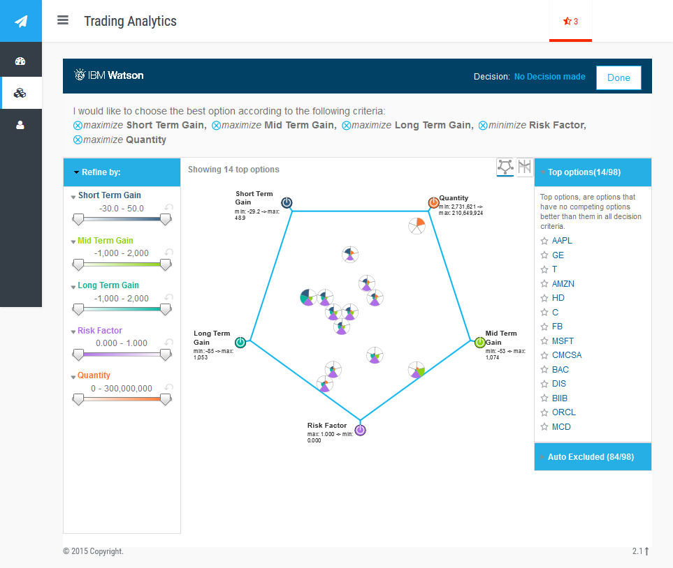

# Warren

### The Super-smart Investment Advisor

Our (prize winning ;) entry to the IBM Bluemix hackathon.

Warren uses several Watson cognitive services (Sentiment Analysis, Personality Insights, Tradeoff Analysis, Relationship Extraction, AlchemyData News to list a few) to recommend stock options.

- The platform has a Flask based API proxy which does the abstraction. Install the dependencies with `pip install -r requirements.txt`, replace the Bluemix API tokens/creds (the preset ones won't work). Then `python ./api.py`

- Install the frontend dependencies
```
bower install Chart.js angular angular-bootstrap animate.css bootstrap-switch checkbox3 font-awesome highcharts jqcloud2 matchHeight typeahead.js ace-builds angular-animate angular-jqcloud bootstrap bootstrap3-typeahead datatables fontawesome jQCloud jquery select2
```

- Replace all API endpoint references in the frontend source files to the API server (yes, I know there should've been a better way to do that). Then, make httpd+php point to `ui/html`



